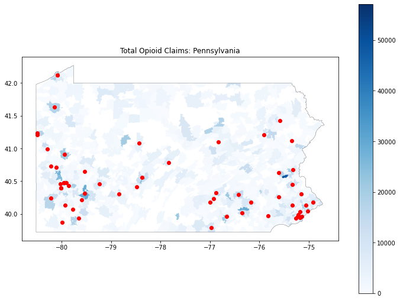
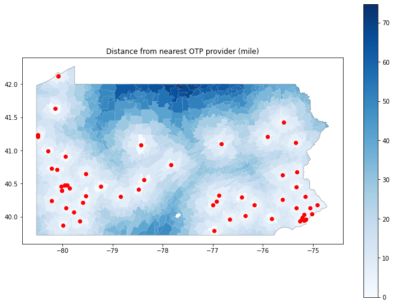
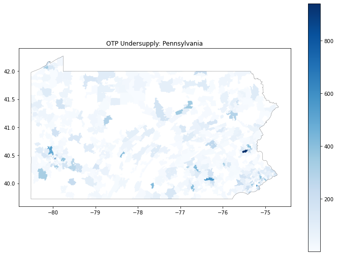
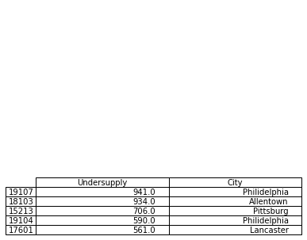

# Opioid Provider Access Metrics Blog Post

by [Andrew Wheeler](mailto:Andrew.wheeler@gainwelltechnologies.com) & Kaden Call

Opioid abuse is currently a major factor in public health. An important component of improving outcomes for individuals abusing opioids is to identify service gaps. Our Data Science team at Gainwell can identify such gaps via data analytics. Below is an example map for Pennslyvania, showing locations of CMS service providers and total *Opioid claims* per zip code:

Service gaps have two components -- one is a service provider nearby? Hot spots of high risk individuals, but have no nearby provider. In Pennslvania, parts in the upper central part of the state (such as around Williamsport) lack nearby access. Some locations need to travel over 70 miles to access a provider:

A second component of service gaps are service providers who are themselves overburdened. Even if a provider is nearby, the total demand for a provider may be too large. We have developed in-house data science tools to estimate that potential left-over demand. The zip-code that has the highest OTP undersupply is located in Philidelphia. In addition the 4th highest is also located in Philidelphia. Even though there are several providers in the area, they are overburdened.

 

Gainwell’s data science and machine learning team has the capabilities to help direct states to either areas where investment in new Opioid treatment centers should be sited, or where current capacity should be expanded to meet potential demand.
